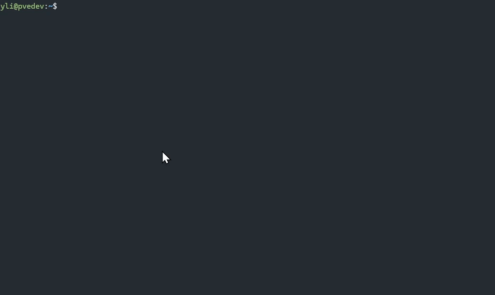

# tmux-start-ui

A mouse-friendly `tmux` configuration that adds interactive menus for common tasks, making it easier to manage sessions, windows, and panes without memorizing every shortcut.



## Features

- **Mouse Support**: Enable scrolling, pane selection, and resizing with the mouse.
- **Context Menus**:
    - **Right-Click on Pane**: Quick access to split, kill, or create new windows/sessions.
    - **Status Bar Click**: Left-click the bottom status bar to open a comprehensive management menu.
- **Keyboard Shortcut**: Press `Prefix + m` to trigger the UI menu at any time.
- **Clipboard Support**: Integrated OSC 52 clipboard support for seamless copying.

## Included Menus

The interactive menus provide quick shortcuts for:
- Splitting windows (Horizontal/Vertical)
- Creating and Switching Windows/Sessions
- Copy Mode management
- Config Reloading
- Detaching and Killing sessions

## Installation

1. Clone this repository or copy the `.tmux.conf` file.
2. Append the contents to your `~/.tmux.conf` or replace it:
   ```bash
   cp .tmux.conf ~/.tmux.conf
   ```
3. Reload your tmux configuration:
   ```bash
   tmux source-file ~/.tmux.conf
   ```
   *Or use the menu option in the UI!*
